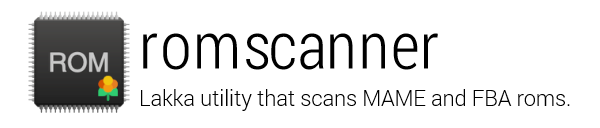

# romscanner
Lakka utility that scans MAME and FBA roms, downloads thumbnails and creates playlists

## Usage
romscanner.sh [OPTIONS] - Manage Lakka Arcade playlists

This script scans MAME and FBA roms, downloads thumbnails and creates
playlists.

Options:
- -f|--force    force roms scan
- -d|--dats     force DAT download
- -s|--storage  storage path (default: /storage)
- -c|--cores    cores path (default: /tmp/cores)
- -h|--help     show this help
- -V|--version  print version number

Notes:
- If no --force, the roms scan will only be performed if a change is detected in the roms directories.
- DAT files: http://www.lakka.tv/doc/Arcade/
- Based on https://github.com/libretro/Lakka/issues/344 by fluffymadness
